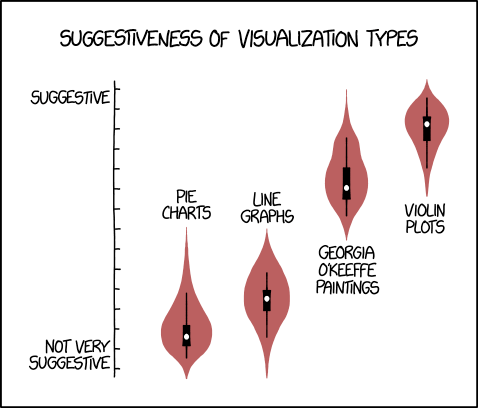

# Exploratory Data Analysis

**Learning objectives:**

- **Classify data** as numeric or categorical.
- Compare and contrast **estimates of location.**
- Compare and contrast **estimates of variability.**
- **Visualize data distributions.**
- **Visualize categorical data.**
- Use **correlation coefficients** to measure association between two variables.
- **Visualize** data distributions in **two dimensions.**

## Structured Data

- Software classifies data by type.
  - Numeric (continuous or discrete)
  - Categorical (binary, ordinal, neither)
- Rectangular data = typical frame of reference for data science.
  - Called a `data.frame` in R
  - Rows are *records* (aka observations, cases, instances)
  - Columns are *features* (aka variables, attributes, predictors in some cases)
  - Lots of synonyms in stats and data science for same things.

## Estimates of Location

- Most basic = mean.
```{r mean}
dataset <- c(3, 4, 1, 2, 10)
mean(dataset) # (3 + 4 + 1 + 2 + 10)/5 = 20/5
```

- Trimming helps eliminate outliers
```{r mean-trim}
mean(dataset, trim = 1/5) # (2 + 3 + 4)/3 = 9/3
```

- Weight to:
  - Down-weight high-variability values.
  - Up-weight under-represented values.
```{r mean-weighted}
weights <- c(1, 1, 11, 1, 1)
weighted.mean(dataset, weights) # (3 + 4 + 11 + 2 + 10)/15 = 30/15
```

- Median: sort then choose middle value.
```{r median}
median(dataset) # 1, 2, (3), 4, 10
```

- Weighted median: similar to weighted mean, but more complicated.
```{r median-weighted}
# Sort then weight then middle of weight. 1*11, 2*1, 3*1, 4*1, 10*1
matrixStats::weightedMedian(dataset, weights)
```

- Technically it interpolates in-between values.
```{r median-weighted-interpolation}
matrixStats::weightedMedian(dataset, weights, interpolate = TRUE)
```

- Can tell it not to interpolate to simplify.
```{r median-weighted-other-options}
matrixStats::weightedMedian(dataset, weights, interpolate = FALSE)
# Equivalent to repeating values weight times.
median(c(rep(1, 11), 2, 3, 4, 10))
```

- Their sample code is available at [github.com/gedeck/practical-statistics-for-data-scientists](https://github.com/gedeck/practical-statistics-for-data-scientists)

## Estimates of Variability

- Variability (aka dispersion) = are values clustered or spread out?

### SD & Friends

- Variance = average of squared deviations, $s^2 = \frac{\sum_{i=1}^{n}{(x_{1}-\bar{x})^2}}{n-1}$
```{r variance}
s_squared <- var(dataset)
s_squared
```

- Standard deviation = square root of variance, $s = \sqrt{variance}$
```{r sd}
s <- sd(dataset)
s
s == sqrt(s_squared)
```

- Median absolute deviation from the median (MAD) is robust to outliers.
```{r MAD}
mad(dataset)
```
Wait, why did that return the standard scale factor?

- `dataset` is `c(1, 2, 3, 4, 10)`
- The difference between any 2 values is `1` (except the outlier)
- `1 * 1.4826 = 1.4826`

### Percentiles & Friends 

- Percentiles = quantiles, $P\%$ of values are $<= x$

```{r quantiles}
x <- sample(1:100, 100, replace = TRUE)
y <- rnorm(100, mean = 50, sd = 20)
quantile(x, probs = seq(0, 1, 0.1))
quantile(y, probs = seq(0, 1, 0.1))
quantile(x) # quartile

IQR(x) # They introduce this later but I like it here.
```

## Histograms & Friends

```{r state}
state <- read.csv("data/state.csv")
head(state)

library(ggplot2)
ggplot(state, aes(y = Population/1000000)) +
  geom_boxplot() +
  ylab("Population (millions)")

ggplot(state, aes(x = Population/1000000)) +
  geom_histogram(
    aes(y = after_stat(density)),
    bins = 10, fill = "white", color = "black"
  ) +
  geom_density(fill = "blue", alpha = 0.5) +
  xlab("Population (millions)")
```

## Visualizing Categorical Data

- Bar charts are boring.
- We'll see some examples related to this in 2D.

## Correlation

```{r correlation}
library(corrplot)
library(dplyr, quietly = TRUE)
sp500_px <- read.csv("data/sp500_data.csv.gz") %>% 
  as_tibble()
sp500_sym <- read.csv("data/sp500_sectors.csv", stringsAsFactors = FALSE) %>% 
  as_tibble()
etfs <- sp500_px %>% 
  filter(X > "2012-07-01") %>% 
  select(
    any_of(
      sp500_sym %>% 
        filter(sector == "etf") %>% 
        pull(symbol)
    )
  )

corrplot(cor(etfs), method = "ellipse")
```

## 2D Distributions



## Meeting Videos

### Cohort 1

`r knitr::include_url("https://www.youtube.com/embed/URL")`

<details>
<summary> Meeting chat log </summary>

```
CHAT LOG
```
</details>
