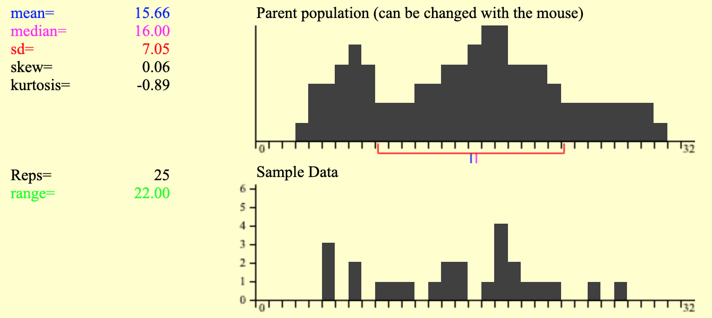
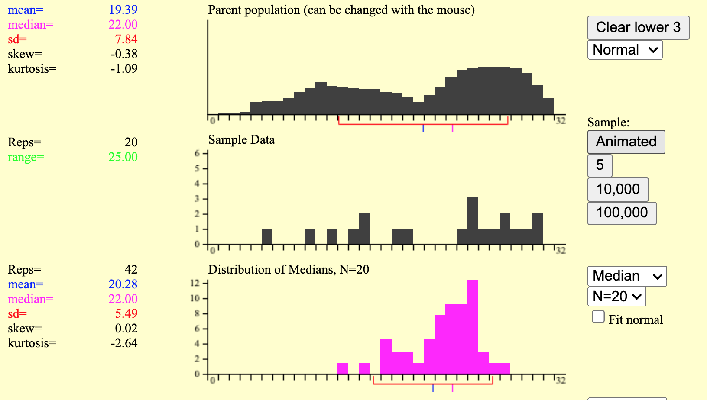
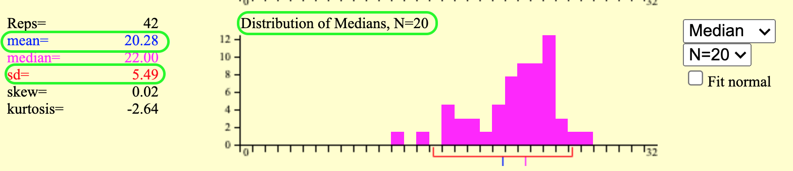
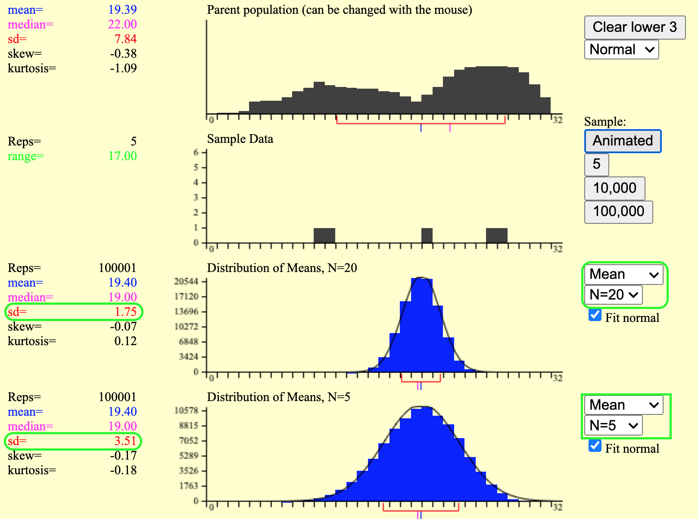

# Data and Sampling Distributions

**Learning objectives:**

- Understand how to **sample from a population**.
- Identify various kinds of **sampling bias**.
- Know how to **avoid bias** in sampling.
- Understand the **distribution of a sample statistic**.
- Use the **bootstrap** to quantify **sampling variability**.
- Calculate **confidence intervals**.
- Recognize the most important common **distributions**.

## What is a Population?

- roughly, "a particular set of things we care about"
- may be concrete
  - the set of people who will vote in the next election
  - all the trees in some forest
- more generally, is *notional*
  - the space of outcomes from rolling a pair of dice
  - all possible offspring from a mating pair of fruit flies
  - the collection of physical *microstates* consistent with a given *macrostate*
  - etc.
 
## Populations {.unnumbered}

A *population* is represented as a *distribution* over one or more 
variables.

- voting populations are a distribution over the **candidates**
- tree populations are a distribution over the **species** of tree, the **diameter** of 
the trunk, the **number** of leaves, the **thickness** of the bark, etc.
- dice outcomes are a distribution over the **number rolled**
- etc.


## Population Statistics {.unnumbered}

The things we care about are *statistics* that can be calculated from the distribution.

- the mode of the candidate distribution
- the median height of the trees, divided by the MAD of the number of 
branchings^[I am sure that nobody cares about this metric. The point is that
a "statistic" can be *any* function of the distribution.]
- the mean and standard deviation of the number rolled
- etc.


## What is a Sample?

We almost never have full access to the population distribution that we care about,
so we have to settle for a *sample*.

 - consists of some number *n* of "individuals" from the population
   - poll 2000 likely voters
   - randomly select 50 trees from the forest to measure
   - roll the dice 100 times
 - drawn at **random** from the population
 - represented by a distribution over the same variables as the population
   
Whatever statistic we wanted to calculate for the population, we instead
   calculate for the sample.


## What is a Sample? {.unnumbered}


The book gives the url for a helpful demo:




## We Have a Problem

The sample is not the population!

The sample statistics we calculate are not equal to the population statistics!

The sample statistic may differ from the population statistic for a variety of reasons:

- random fluctuation
- bias
  - selection bias (the sample may not have been drawn randomly from the population)
  - sample size bias^[the book glosses over this, so I don't know if there's a more
  standard term than just "bias"] (some sample metrics will be inherently and 
  systematically different from population metrics just because of the limited
  size of the sample)


## The Ideal Solution

*If* we had the resources to take many samples (e.g. 100 other research groups
doing the same study of the forest that we are), then we could do the following:

- Repeat the sampling process some number of times, taking a new random sample 
each time.
- For **each** sample, calculate the sample statistic.
- Make a histogram of all the resulting values for the sample statistic.



## The Ideal Solution {.unnumbered}


The resulting **sampling distribution** of the statistic would help us understand
the results of our sampling experiment.

- The **mean** of the sampling distribution is (an estimate of) the value of the 
statistic that our experiment is "aiming at".^[This may **not** be equal to the 
population statistic, due to sample size bias. For example, if my target 
statistic is the range of some variable, the sample statistic will always be less
than or equal to the population statistic. And so the mean of the sampling 
distribution for the range will be less than the population range. 
Some statistics, like the mean, are known to be *unbiased statistics*, while 
others are known to be biased.]
- The **standard deviation** of the distribution is (an estimate of) how much 
random fluctuations are likely to influence our measurement. This is also known 
as the *standard error* of our calculated sample statistic.



## The Central Limit Theorem 


In the special case where our sample statistic is the **mean**, it can be shown
that:

 - the sampling distribution approaches a **normal distribution**. 
 - an estimate of the standard deviation of that distribution is
given by the **standard deviation of an individual sample, divided by the square 
root of the sample size**.




## The Bootstrap Solution

If our sample statistic is the mean^[or other statistic for which a theoretical 
approximation to the standard error has been derived], we can estimate the
standard error from a single sample. 

Otherwise, to measure the standard error of our sample statistic, we would have
to **repeat our sampling process many times** to be able to calculate the standard
deviation of the sampling distribution. (Of course, if we actually did this, our
calculated standard error would be pretty useless, because we'd have a better 
estimate of the statistic from the combined samples.)

In practice, we can use a **bootstrap**.

## The Bootstrap {.unnumbered}

The bootstrap is a simple but powerful technique for estimating the standard
error of *any* sample statistic from a single sample. We will also
obtain an estimate of the sample size bias for our sample statistic.

Sounds too good to be true. Where does this amazing capability come from?

## The Bootstrap {.unnumbered}

The bootstrap works like this:

- Assume that the sample distribution is representative of the population 
distribution.^[It doesn't have to be perfect, but if it's *too* far off then 
nothing you calculate from the sample will be meaningful anyway.]
- Construct a new *simulated* population by making a gazillion copies of your
sample (in practice, this just means you draw from the sample *with replacement*).
- Now it is easy to do lots of simulated experiments on your simulated population!
  - Draw lots of bootstrap samples from your simulated population, with each 
  sample having the same *n* as your original sample.
  - Calculate your sample statistic for each of the bootstrap samples.
  - Calculate the standard deviation of the resulting distribution (of 
  bootstrapped sample statistics); this is the estimated **standard error** for your
  measured sample statistic.
  - Calculate the difference between the mean of the bootstrap distribution and
  the statistic calculated on your original sample; this is the estimated **bias** for
  your measurement.


We can use the same sampling [demo](https://onlinestatbook.com/stat_sim/sampling_dist/)
to get a feel for how bootstrapping works.

## The Bootstrap: Limitations {.unnumbered}

The bootstrap isn't magic. 

It won't give you a better estimate of your sample statistic.^[Well, having an 
estimate of the sample size bias can help.]

It won't fix selection bias.

It won't fill gaps in your sample data.

It *does* help you understand the limitations of your experimental procedure.


## Confidence Intervals

A **confidence interval**, like the standard error, is a way to estimate the 
reliability of a sample statistic.

For example, a 95% CI is an interval that would contain the central 95% of values
for the sample statistic, if the sampling experiment were done a very large number
of times.

It's generally not practical to *actually* sample that many times, so...
bootstrap!

For comparison, plus or minus one SE gives a CI of about 68%. 

## Some Important Distributions

The rest of the chapter is about specific distributions.

Many of these distributions will come up again in particular contexts in 
following chapters.

## The Normal Distribution

```{r echo=FALSE, results=FALSE, message=FALSE}
library(dplyr)
library(ggplot2)
library(purrr)
```


```{r}
normal_values <- rnorm(n = 10000)

hist(normal_values, breaks = 30)

# qqnorm plots the location of quantiles of the given distribution
# vs locations of corresponding quantiles of normal distribution.

qqnorm(normal_values); qqline(normal_values, col = 2)
```

## Student's t-Distribution

```{r}
# t-distribution is a family parameterized by degrees of freedom
t_values <- rt(n = 10000, df = 10)

hist(t_values, breaks = 30)

# normalize distribution for QQ
t_values <- (t_values - mean(t_values))/sd(t_values)
qqnorm(t_values); qqline(t_values, col = 2)
```

## The Binomial Distribution

```{r}
# flipping 6 fair coins at a time, how many heads do we get?
binom_values <- rbinom(n = 10000, 6, 0.5)

hist(binom_values, breaks = 30)

# normalize distribution for QQ
binom_values <- (binom_values - mean(binom_values))/sd(binom_values)
qqnorm(binom_values); qqline(binom_values, col = 2)
```

## The Chi-Square Distribution

```{r}
# family of distributions parameterized by degrees of freedom
chisq_values <- rchisq(n = 10000, df = 5)

hist(chisq_values, breaks = 30)

# normalize distribution for QQ
chisq_values <- (chisq_values - mean(chisq_values))/sd(chisq_values)
qqnorm(chisq_values); qqline(chisq_values, col = 2)
```


## The F-Distribution

```{r}
# family of distributions parameterized by TWO df1 values
f_values <- rf(n = 10000, df1 = 15, df2 = 50)

hist(f_values, breaks = 30)


# normalize distribution for QQ
f_values <- (f_values - mean(f_values))/sd(f_values)
qqnorm(f_values); qqline(f_values, col = 2)

```


## The Poisson Distribution

```{r}
# family of distributions parameterized by lambda ("mean rate")
poisson_values <- rpois(n = 10000, lambda = 5)

hist(poisson_values, breaks = 30)

# normalize distribution for QQ
poisson_values <- (poisson_values - mean(poisson_values))/sd(poisson_values)
qqnorm(poisson_values); qqline(poisson_values, col = 2)
```


## Meeting Videos

### Cohort 1

`r knitr::include_url("https://www.youtube.com/embed/URL")`

<details>
<summary> Meeting chat log </summary>

```
CHAT LOG
```
</details>
