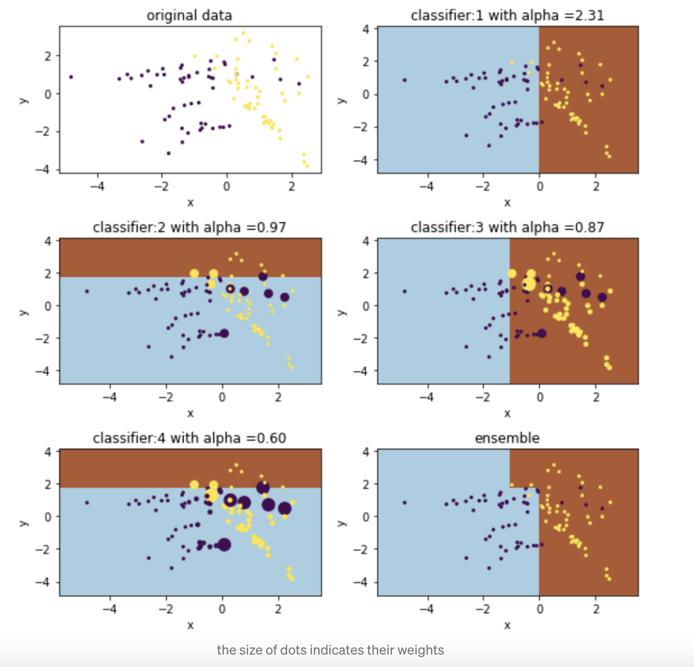

# Statistical Machine Learning

**Learning objectives:**

- Apply the K-Nearest Neighbors (KNN) algorithm.
- Use decision tree models to classify or predict an outcome.
- Use random forest models to classify or predict an outcome.
- Use boosted tree models to classify or predict an outcome.

## Statistical Machine Learning {.unnumbered}

This chapter covers some of the statistical methods
used for machine learning.

Most of statistics (at least, in this book) deals with *inference*, and
specifically *inductive inference*: reasoning from particular examples to draw
more general conclusions.

*Machine learning* is explicitly inductive: we construct a general model from a
set of example data, and that general model is used to draw conclusions about
new cases (*features* -> *target*; see terminology in Chapter 1).

## KNN

The conceptually simplest way to reason about new data is to assume that
examples that have similar features will also have similar targets.

- KNN applies this assumption directly by comparing new data with the known
examples that have the most closely matching features to the new data (the
"nearest neighbors").
- How many neighbors?
  - Too few: overfit.
  - Too many: underfit (oversmooth).
- How do we measure "closeness"?
  - Pick a distance metric.
  - (Usually) normalize the variables.


## Tree Models

A decision tree is a nice way to build a model that can be intuitively
understood by the humans.

- List of binary decisions that are applied sequentially to new data.
- Relatively transparent:
  - Easy to understand how the model works.
  - Easy to understand how the decision rules were obtained.
  - The rules themselves are interpretable (at least superficially).
- How big to let the tree grow?
  - Too big: overfit.
  - Too small: underfit.
 
Unlike KNN, which always takes the *K* nearest "neighbors" of the new example, a
decision tree divides the feature space into a set of fixed "neighborhoods."


## Bagging and the Random Forest

The basic insight behind *bagging* is that an *ensemble* of models, where the
predictions of many different models are averaged, is generally better than any
individual model.

- One way to build an ensemble is to train different kinds of models on the same
data. This is hard to scale--each new model needs to be developed individually.
- A more automatible way to make something like an ensemble is to train lots of
the same *kind* of model on different sets of training data. 
  - How do we get different sets of training data? Bootstrap the original set!
  - This is called *bagging*.
- Any model type can be bagged.
- When a decision tree is bagged, there is usually an extra step performed: only
a random subset of the feature set is used for any individual tree model.
  - This is known as a *random forest*™.
  - A random forest is less interpretable than a single tree, but the relative
  importance of the features can be estimated.
    - Randomize the values of a feature and measure the resulting loss of model
    accuracy. 
    - Measure the average purity gain for decisions made on each feature.
 


## Boosting

Boosting is like making an ensemble, but each additional model in the ensemble
is specifically aimed at overcoming the deficiencies in the previous model.

I found the description of boosting in the book to be a bit lacking, and there
is a typo in one of the crucial equations (bottom of p. 271 in 2e). I found a 
helpful reference (with diagrams) here:
https://towardsdatascience.com/boosting-algorithms-explained-d38f56ef3f30

The basic idea (for Adaboost, at least): all training examples are *weighted*,
so that their relative importance can be adjusted. When an example is
misclassified by one of the models in the ensemble, its weight is increased for
the next model.

## Boosting {.unnumbered}

(Diagram from https://towardsdatascience.com/boosting-algorithms-explained-d38f56ef3f30)


## Boosting {.unnumbered}

Boosting is powerful, but touchy--it is easy to overfit.

Avoid by *regularizing*: penalize complex models to reduce the size of the
component trees.

## Meeting Videos

### Cohort 1

`r knitr::include_url("https://www.youtube.com/embed/ZVy-d-MaBm4")`

<details>
<summary> Meeting chat log </summary>

```
00:24:32	Jon Harmon (jonthegeek):	p241 is the image.
00:48:07	Jon Harmon (jonthegeek):	The link Jonathan references for a boosting definition: https://towardsdatascience.com/boosting-algorithms-explained-d38f56ef3f30 (will also be in the slides at r4ds.io/ps4ds this afternoon)
```
</details>
